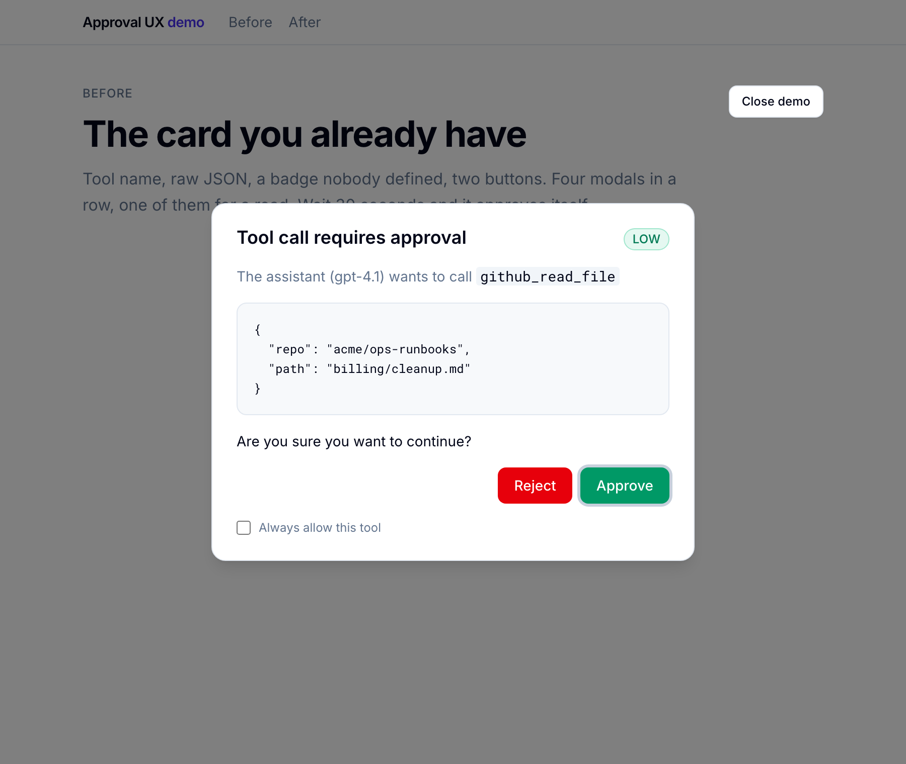
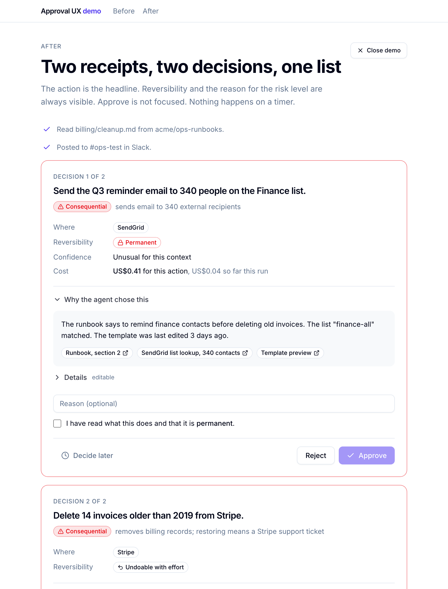

# agent-approval-ux

An Agent Skill for the moment a human decides about an AI agent's action. It tells coding agents what a decision surface must show, which actions to offer, when to gate at all, and how to review an approval flow that already exists.

*Stop rendering JSON and calling it consent.*

[](https://skills.sh/tpjnorton/agent-approval-ux)

## Install

```bash
npx skills add tpjnorton/agent-approval-ux
```

Works with Claude Code, Codex, Cursor, Copilot and anything else that reads `SKILL.md`. Add `-g` for a user-wide install, `-a claude-code` to target one agent.

## What it does

**Generate mode.** When you ask your coding agent to build human-in-the-loop, approval, confirmation or permission UI for an agent, in any stack, it reads the rules and produces a conforming decision surface.

**Review mode.** Point it at an existing approval component or flow. It audits against a fixed checklist and reports findings ranked by severity, each with a concrete fix. Default posture: flag, don't praise.

## The rules, in one screen

- **Gate only when all three hold**: effect outside the sandbox, not trivially reversible, not pre-authorised. Never gate reads. Otherwise run it and show a receipt.
- **Required on every card, in this order**: the action in one plain sentence, the systems touched, reversibility (`undoable`, `undoable with effort`, `permanent`). Then, collapsed: why, confidence (only if real), cost, arguments.
- **Exactly four actions**: approve, reject (reason optional), edit and approve, defer.
- **Three risk levels by consequence**, each with a stated reason. "Consequential: sends email to 340 external recipients."
- **Batch as a list**, never a stack of modals. Bulk approve for routine only.
- **Nothing happens on timeout.** Not approve, not reject. Deferred.
- **Never block the UI.** Never distinguish approve from reject by colour alone. Never put a tool name in the headline.

Full rules: [`skills/agent-approval-ux/SKILL.md`](skills/agent-approval-ux/SKILL.md). Why each rule exists: [`references/rationale.md`](skills/agent-approval-ux/references/rationale.md).

## Before and after

The `demo/` folder is a Next.js app with one scripted agent run rendered twice.

| Before | After |
|---|---|
|  |  |

```bash
cd demo && npm install && npm run dev
```

## Layout

```
skills/agent-approval-ux/
  SKILL.md                    the rules, as instructions to an agent
  references/
    rationale.md              why each rule exists, with sources
    review-checklist.md       the audit, with fixed severities
    copy-guide.md             patterns and rewrites for user-facing text
    schema.json               the decision payload
    response.schema.json      what the surface returns
  examples/
    shared/                   DecisionCard.tsx and types, framework-agnostic
    ai-sdk/                   Vercel AI SDK tool approval
    ag-ui/                    CopilotKit useHumanInTheLoop / AG-UI interrupt
    mcp/                      MCP tool annotations and elicitation
demo/                         Next.js before/after
docs/essay.md                 the argument, 1,600 words
```

## Stacks

The rules are stack-agnostic. The examples show the adapters for AI SDK (`toolApproval` / `addToolApprovalResponse`), CopilotKit and AG-UI (`useHumanInTheLoop`, interrupt and resume), and MCP (`readOnlyHint` and friends, elicitation's accept/decline/cancel). Each is a thin mapping from the framework's payload onto `ApprovalDecision` and back from `ApprovalResponse`.

## Scope

v1 is the approval half. Receipts and undo as a first-class surface, multi-agent triage and attention policy learning are v2 and v3.

## Maintenance

Opinionated. Small. PRs welcome for stack examples and bug fixes. Feature requests mostly declined. Rules change by argument in an issue, not by vote. This is an opinion with evidence, not a standard.

## Licence

MIT.
